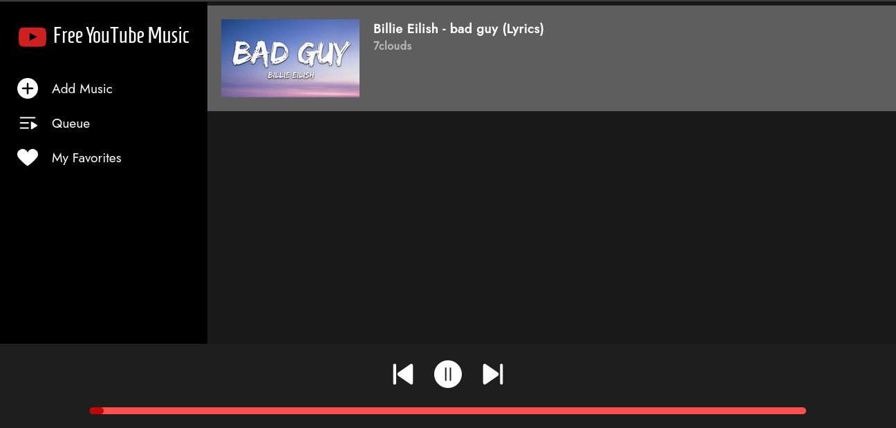

<h1>

Free YouTube Music
</h1>

<h3>
A free music streaming service.
</h3>

#### **Stream music now**

**⚠️ Please note that FYTM is still under development ⚠️**

- Adding tracks to favorites is not working yet

<h3>
How to use
</h3>

#### **Step 1**

Go to [FYTM](https://youssef-attai.github.io/fytm), and click **Add Music** in the side menu.

#### **Step 2**

Go to any song/track you want on [YouTube](https://youtube.com) and copy the video's URL.

#### **Step 3**

Paste the YouTube video URL into the **Add Music Bar**, and when the video shows up in the embeded YouTube frame, click on **Add to Queue**.

#### **Step 4**

Click **Queue** in the side menu, you should see the track you just added in the playing queue.

#### **Step 6**

Hit the **play** button and enjoy!
